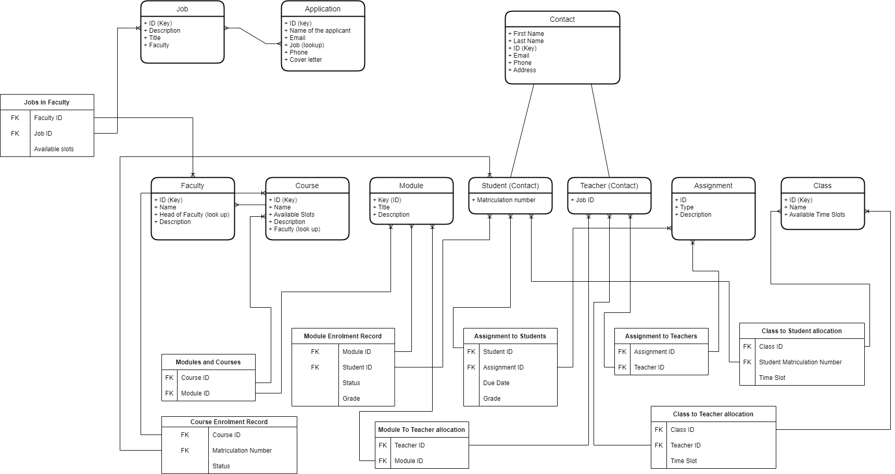

# "Dataverse" database

## 1. Architecture

## 2. List of entities

These tables represent particular entities in the university

1. [Application Entity](./application.md)
2. [Assignment](./assignment.md)
3. [Class](./class.md)
4. [Contact](./contact.md)
5. [Course](./course.md)
6. [Faculty](./faculty.md)
7. [Job](./job.md)
8. [Module](./module.md)
9. [Student](./student.md)
10. [Teacher](./teacher.md)

## 3. List of relationship tables

These tables link entities together

1. [Assignment to Students](./assignment_to_students.md)
2. [Assignment to Teachers](./assignment_to_teachers.md)
3. [Class to Students](./class_to_student.md)
4. [Class to Teachers](./class_to_teacher.md)
5. [Course enrollment](./course_enrolment.md)
6. [Module Enrollment](./module_enrollment.md)
7. [Module to Teachers](./module_to_teacher.md)
8. [Modules and Courses](./modules_and_courses.md)