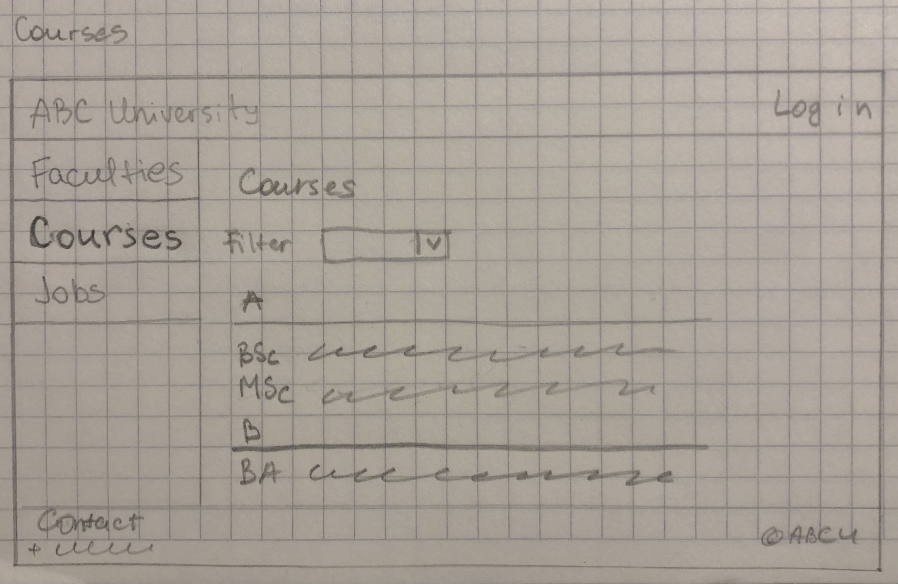
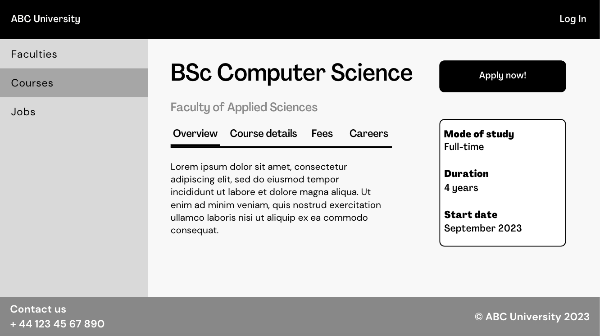
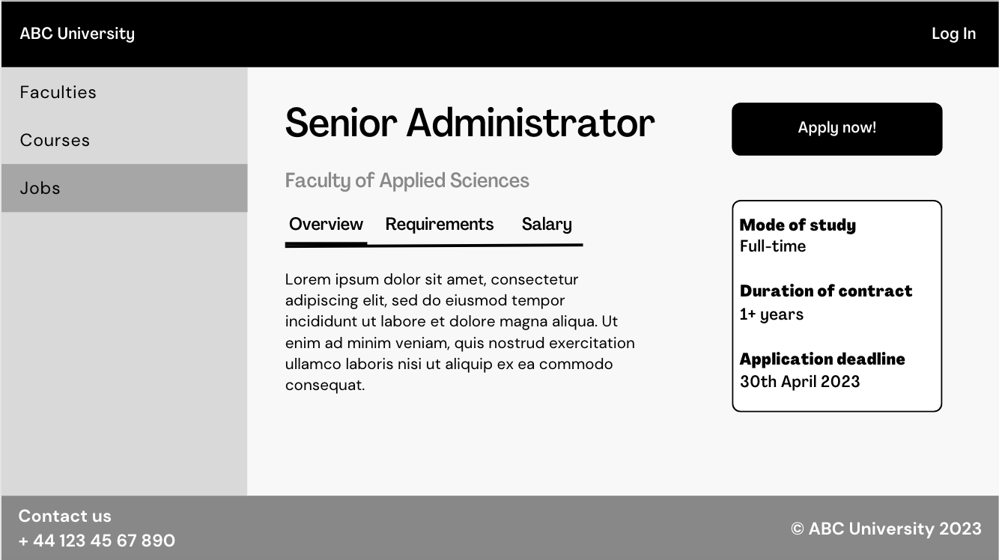
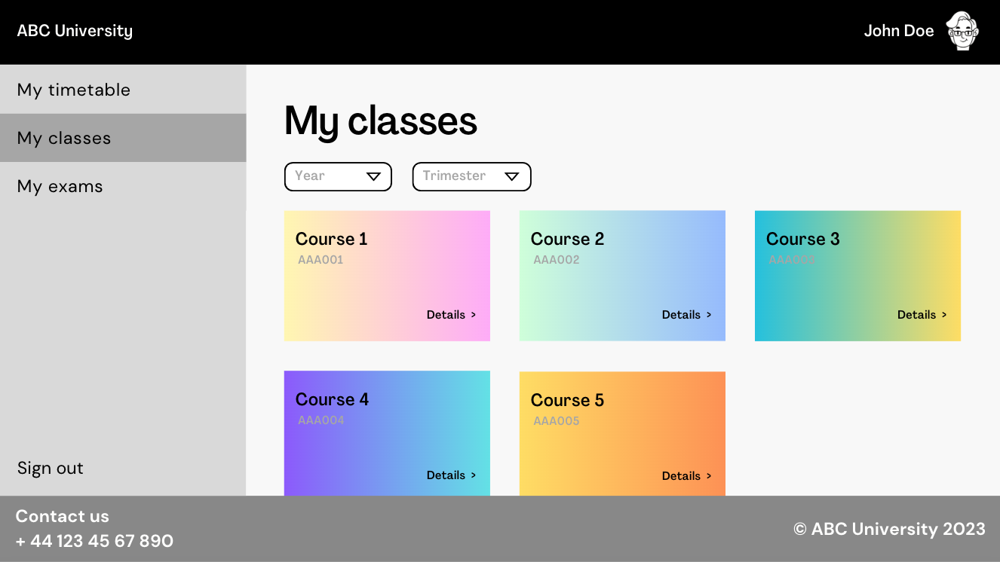
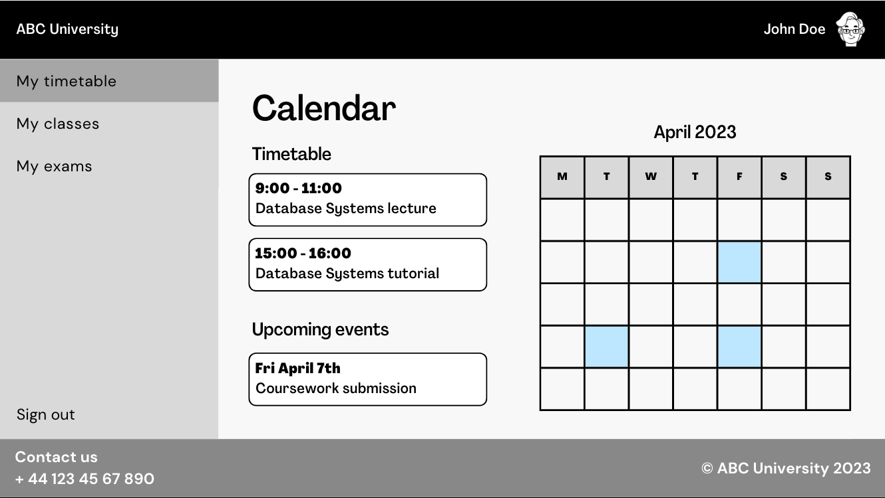
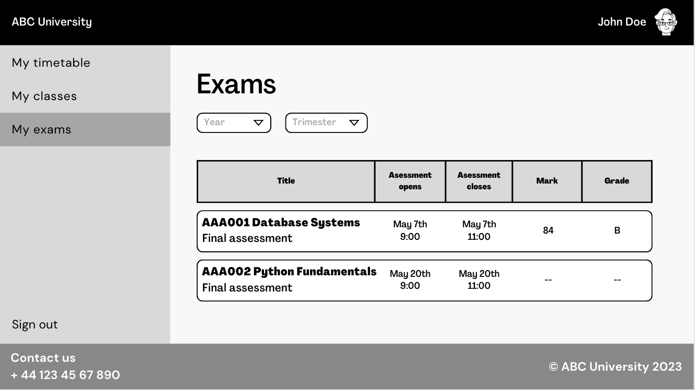
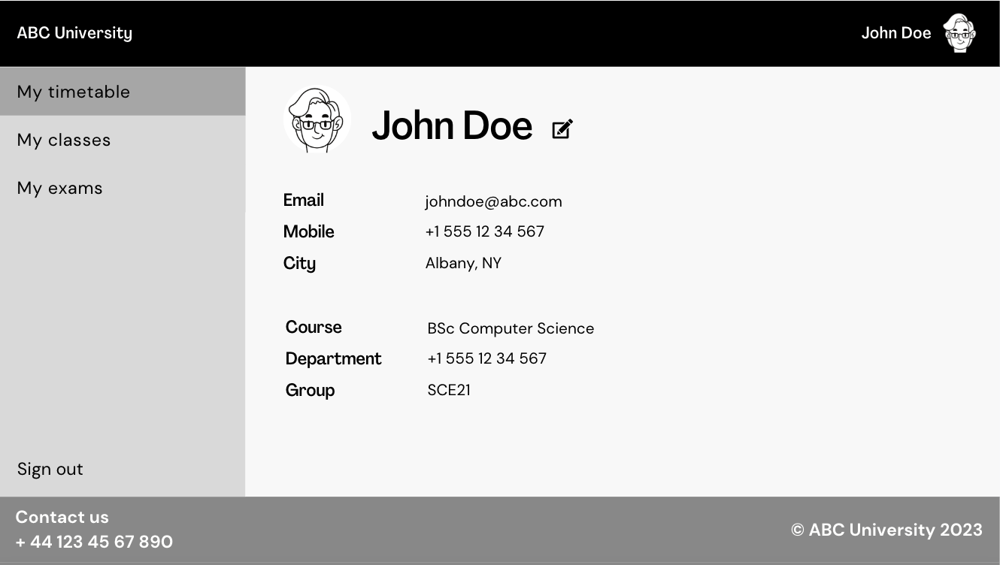
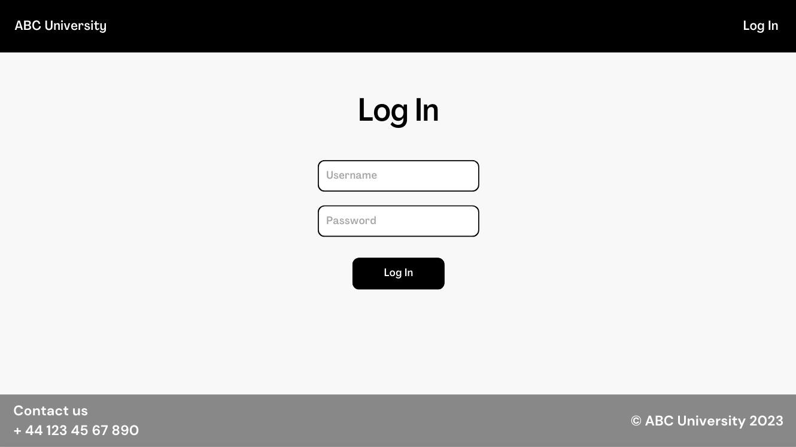

# Pages templates for Power Apps

### Homepage


Header and footer (present in all pages). Top bar contains University name (homepage button) and log in button. 
\Side menu contains ```Faculties```, ```Courses```, and ```Jobs``` options -- pages for non authenticated users. 
Static info about the university is the scrollable main body, beginning with an image banner/title.
The footer has contact informaiton/websiyt copyright/etc

### Faculties page


Highlighted selection of the ```Faculties``` page in the menu. University faculties are listed in a tile arrangement. 
Each tile contains the faculty name, brief description, and ```Read more >``` button at the bottom.

### Courses page

Highlighted selection of the ```Courses``` page in the menu. University faculties are listed in alphabetical order (could be grouped by letter).
There is a filter at the top of the list for selecting a specific faculty.

### Jobs page


Highlighted selection of the ```Jobs``` page in the menu. Job opportunities listed in a tile arrangement (could be grouped by department). 
Could be listed one after the other, or swiped through using an arrow.

### Course description page



### Job description page



### My Classes page



### My Timetable page


### My Exams page


### Profile page


### Log In page


